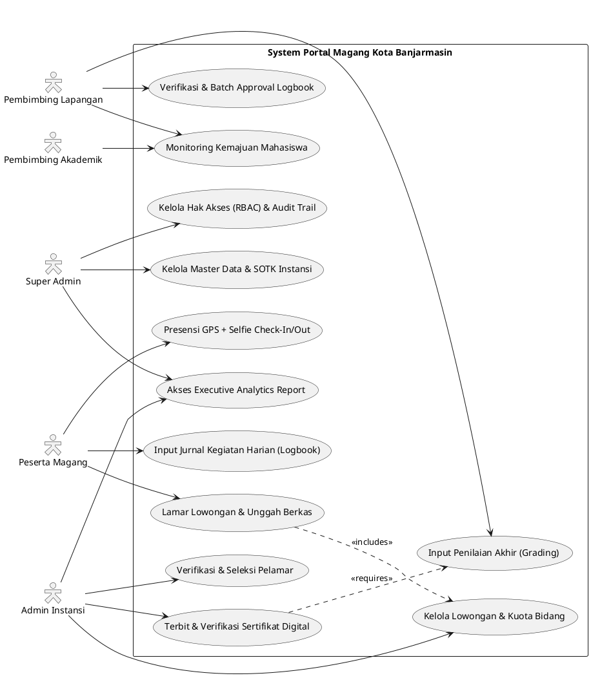
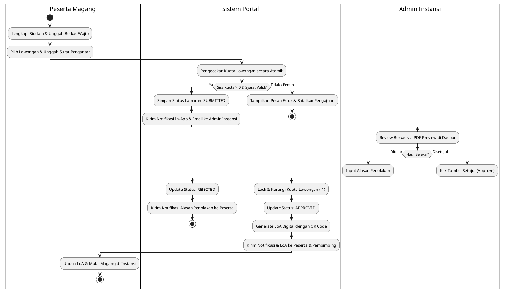
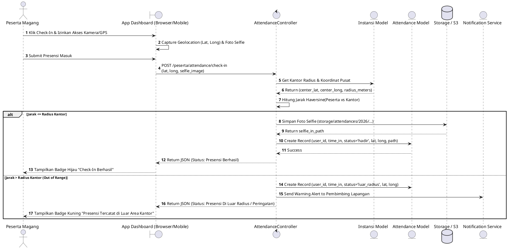

# DOKUMEN RENCANA PENGEMBANGAN DAN PENYEMPURNAAN APLIKASI (APPLICATION ENHANCEMENT PLAN)
## PORTAL MAGANG PEMERINTAH KOTA BANJARMASIN

**Versi:** 2.1 (Enhancement Blueprint - Final Decision)  
**Tanggal:** Juli 2026  
**Disusun oleh:** Senior Business Analyst, System Analyst, UI/UX Architect & Software Solution Architect  
**Status Keputusan Arsitektur:**  
- **TTE Verification:** Menggunakan *Dummy/Mock Signature Service* & QR Verification internal terlebih dahulu (siap diintegrasikan ke BSrE BSSN pada tahap lanjutan).  
- **Notifikasi Gateway:** Fokus pada *In-App Notification* & *Email Broadcast*. Modul WhatsApp Gateway tidak diimplementasikan saat ini (akan ditambahkan secara mandiri oleh tim pengembang di tahap berikutnya).

---

## DAFTAR ISI
1. [Analisis Aplikasi Eksisting](#1-analisis-aplikasi-eksisting)
2. [Analisis GAP (Gap Analysis)](#2-analisis-gap-gap-analysis)
3. [Rekomendasi Penyempurnaan Landing Page](#3-rekomendasi-penyempurnaan-landing-page)
4. [Evaluasi dan Penyempurnaan Dashboard](#4-evaluasi-dan-penyempurnaan-dashboard)
5. [Rekomendasi Pengembangan Modul (21 Modul)](#5-rekomendasi-pengembangan-modul)
6. [Penyempurnaan Proses Bisnis (Workflow)](#6-penyempurnaan-proses-bisnis)
7. [Evaluasi Struktur Database](#7-evaluasi-struktur-database)
8. [Evaluasi Diagram Sistem (ASCII & PlantUML)](#8-evaluasi-diagram-sistem)
9. [Penyempurnaan Laporan (8 Laporan Eksekutif)](#9-penyempurnaan-laporan)
10. [Penyempurnaan Notifikasi (Email & In-App)](#10-penyempurnaan-notifikasi)
11. [Rekomendasi Keamanan Sistem (SPBE Compliant)](#11-rekomendasi-keamanan)
12. [Roadmap Pengembangan (10 Fase Implementasi)](#12-roadmap-pengembangan)
13. [Risiko dan Strategi Mitigasi](#13-risiko-dan-mitigasi)
14. [Rekomendasi Fitur Baru (Advanced Features)](#14-rekomendasi-fitur-baru)

---

## 1. ANALISIS APLIKASI EKSISTING

Aplikasi **Portal Magang Pemerintah Kota Banjarmasin** saat ini dibangun menggunakan kerangka kerja (framework) **Laravel** dengan basis data **MySQL/MariaDB**. Aplikasi ini dirancang untuk menjembatani kebutuhan penerimaan dan pengelolaan peserta magang dari berbagai perguruan tinggi/sekolah ke instansi-instansi di lingkungan Pemerintah Kota Banjarmasin.

### A. Fungsi Utama yang Sudah Tersedia
- **Otentikasi & Multi-Role Management**: Mendukung 5 peran utama, yaitu *Super Admin (Admin Kota)*, *Admin Instansi*, *Pembimbing Lapangan*, *Pembimbing Akademik/Sekolah*, dan *Peserta Magang*.
- **Manajemen Lowongan & Kuota**: Admin Instansi dapat membuka lowongan magang (*InternshipPosition*) serta mengelola kuota penempatan per bidang/unit kerja.
- **Pendaftaran & Pengajuan Lamaran**: Peserta dapat mengisi biodata akademik, mengunggah berkas pendukung, dan mengajukan lamaran (*Application*) pada lowongan yang terbuka.
- **Pencatatan Presensi & Jurnal Harian**: Fitur presensi (*Attendance*) berbasis koordinat/radius lokasi kantor dan pencatatan kegiatan harian (*DailyLog*).
- **Penilaian & Penerbitan Sertifikat**: Pembimbing dapat memberikan penilaian aspek kompetensi/disiplin, dan sistem dapat mencetak sertifikat atau transkrip nilai dalam format PDF.

### B. Kelebihan Aplikasi Saat Ini
1. **Arsitektur MVC yang Terstruktur**: Menggunakan fondasi Laravel modern yang memudahkan pemeliharaan kode dan ekspansi fitur.
2. **Validasi Geolocation Presensi**: Telah mengimplementasikan parameter koordinat (`latitude`, `longitude`) dan radius maksimal pada tabel instansi untuk mencegah kecurangan absen jarak jauh.
3. **Pencatatan Audit Dasar**: Telah terdapat tabel `audit_logs` yang siap digunakan untuk melacak riwayat aktivitas krusial pengguna.
4. **Pemisahan Alur Pembimbing Lapangan dan Sekolah**: Memungkinkan verifikasi ganda baik dari pihak kantor (instansi) maupun pihak kampus/sekolah.

### C. Kekurangan Aplikasi
1. **Kurangnya Fleksibilitas RBAC Granular**: Hak akses saat ini masih bergantung pada pengecekan level peran statis (`role`), belum memanfaatkan sistem hak akses dinamis berbasis izin (*Permission-based Access Control*) yang memungkinkan kustomisasi kewenangan per modul.
2. **Absensi Rentan Spoofing**: Validasi presensi berbasis koordinat web masih dapat diakali menggunakan *Fake GPS/Mock Location* karena belum mewajibkan verifikasi biometrik atau foto swafoto (*selfie verification*).
3. **Minimnya Otomasi Komunikasi Eksternal**: Sistem notifikasi saat ini masih berfokus pada layar aplikasi internal (`flash messages`); belum terintegrasi optimal dengan *Email Broadcast* berbasis *Queue* untuk mempercepat respon pelamar dan pembimbing.
4. **Keaslian Dokumen & Sertifikat Belum Terdigitalisasi Sempurna**: Sertifikat yang dihasilkan masih berupa file PDF generik tanpa verifikasi kriptografi. Diperlukan implementasi **Dummy/Mock Electronic Signature & QR Code Verification Engine** sebagai fondasi awal sebelum dihubungkan ke server TTE BSrE di masa depan.
5. **Laporan & Analitik Masih Tersebar**: Laporan saat ini berfokus pada transaksional tunggal, belum menyediakan *Executive Dashboard* yang merangkum tren demografi, efektivitas penyerapan kuota, dan sebaran disiplin ilmu di Kota Banjarmasin.

### D. Kendala yang Sering Terjadi di Lapangan
- **Peserta Resign/Mundur Tanpa Pemberitahuan**: Mengakibatkan kuota instansi tetap terkunci (`approved`) padahal peserta tidak aktif, sehingga pelamar lain kehilangan kesempatan.
- **Ketidaksesuaian Format Unggahan**: Peserta mengunggah file gambar/PDF dengan resolusi terlalu besar atau format rusak yang membebani server dan menyulitkan pembimbing saat verifikasi.
- **Keterlambatan Penilaian Akhir**: Pembimbing sering terlambat mengisi form nilai karena tidak ada pengingat otomatis (*automated reminder*) menjelang masa akhir magang.

### E. Peluang Peningkatan Sistem
- **Integrasi Ekosistem e-Government Pemkot Banjarmasin**: Memanfaatkan *Single Sign-On (SSO)* pegawai dan verifikasi data kependudukan (NIK/Dukcapil) atau data mahasiswa (PDDIKTI).
- **Transformasi Menjadi Portal Satu Data Magang Daerah**: Menjadikan aplikasi ini sebagai acuan utama BKD dan Dinas Pemuda & Olahraga dalam memetakan potensi SDM muda di Kota Banjarmasin.

---

## 2. ANALISIS GAP (GAP ANALYSIS)

Berikut adalah perbandingan terperinci antara kondisi saat ini dengan target pembaruan yang diusulkan:

| Area / Modul | Kondisi Saat Ini | Permasalahan | Dampak | Solusi yang Diusulkan | Prioritas |
| :--- | :--- | :--- | :--- | :--- | :---: |
| **Otentikasi & Otorisasi** | Login email/password biasa, role statis (`users.role`). | Tidak bisa memodifikasi hak akses admin instansi/pejabat tanpa ubah kode. | Fleksibilitas rendah saat terjadi re-organisasi dinas. | Implementasi **Spatie RBAC Granular** + **MFA/2FA** + **SSO Pemkot/Google**. | **Tinggi** |
| **Pendaftaran & Verifikasi Berkas** | Peserta mengunggah berkas PDF secara manual tanpa pengecekan format otomatis. | Berkas sering salah/buram, admin menghabiskan waktu lama untuk periksa fisik. | Waktu seleksi lambat dan membebani server dengan file berukuran raksasa. | Kompresi otomatis, validasi tipe MIME ketat, *In-Browser PDF Preview*, & **OCR Assistant**. | **Tinggi** |
| **Manajemen Kuota & Lowongan** | Kuota dihitung dari jumlah pelamar `approved`, kurang penanganan kasus *resign*. | Kuota hangus jika peserta mundur di tengah jalan. | Instansi kekurangan tenaga magang yang dibutuhkan. | Fitur **Re-alokasi Kuota Otomatis** saat status berubah menjadi `dibatalkan` / `dikeluarkan`. | **Tinggi** |
| **Presensi & Kehadiran** | Presensi dengan koordinat GPS dan radius kantor (`instansi.radius_absen`). | Rentan manipulasi *Fake GPS* tanpa bukti kehadiran fisik di lokasi. | Data kehadiran kurang akurat dan dapat disalahgunakan. | **Swafoto (Selfie) Geotagging + Anti-Spoofing Detection** & *Log IP Address/Device*. | **Tinggi** |
| **Monitoring Jurnal & Penilaian** | Jurnal harian (`daily_logs`) diisi teks dan diverifikasi manual di akhir periode. | Pembimbing kebingungan menilai objektivitas kegiatan yang sudah lampau. | Penilaian tidak mencerminkan kontribusi harian yang sebenarnya. | **Jurnal Interaktif dengan Approval Mingguan** + *Automated Reminder* untuk pembimbing. | **Sedang** |
| **Penerbitan Sertifikat** | Generate PDF statis berbasis template Blade biasa. | Rawan pemalsuan oleh pihak yang tidak bertanggung jawab. | Menurunkan kredibilitas sertifikat resmi Pemkot Banjarmasin. | **QR Code Verification System + Dummy/Mock Electronic Signature Service** (penandatanganan digital internal). | **Tinggi** |
| **Analitik & Ekspor Laporan** | Laporan transaksional terpisah dalam format tabel sederhana. | Pimpinan (Wali Kota/Kepala Dinas) sulit melihat ringkasan strategis dengan cepat. | Pengambilan keputusan kebijakan magang daerah kurang berbasis data. | **Executive Analytics Dashboard** (Grafik interaktif) & **Export Multi-Format (PDF, Excel, CSV)**. | **Sedang** |
| **Komunikasi & Notifikasi** | Notifikasi terbatas pada layar aplikasi internal atau *flash message*. | Peserta/Pembimbing sering terlewat informasi penting jika tidak login. | Proses *shortlist*, *approval*, dan *grading* menjadi tertunda lama. | **Integrasi Email Broadcast via Queue & In-App Alerts** (WhatsApp disiapkan secara modular untuk ditambahkan mandiri kemudian). | **Tinggi** |

---

## 3. REKOMENDASI PENYEMPURNAAN LANDING PAGE

Landing Page adalah wajah utama Pemerintah Kota Banjarmasin di mata publik, mahasiswa, dan akademisi. Evaluasi dan perbaikan dirancang untuk memberikan kesan profesional, modern, informatif, dan transparan.

### A. Struktur Menu Baru yang Direkomendasikan
1. **Beranda (Home)**: *Hero banner* dinamis dengan slogan pemuda membangun Kota Banjarmasin.
2. **Katalog Lowongan (Explore Opportunities)**: Daftar posisi magang yang sedang dibuka, dilengkapi filter interaktif (Bidang Ilmu, Nama Instansi, Durasi, dan Sisa Kuota).
3. **Alur & Syarat Magang (How It Works)**: Infografis interaktif 5 langkah mudah melamar magang.
4. **Daftar Instansi (Our Partners)**: Direktori Dinas, Badan, dan Bagian di lingkungan Pemkot Banjarmasin yang menerima magang.
5. **Statistik Publik (Open Data Magang)**: Transparansi data real-time (Jumlah Lowongan, Peserta Aktif, Kampus Tergabung, dan Alumni).
6. **Berita & Pengumuman (News & Announcements)**: Portal informasi jadwal gelombang penerimaan dan berita kegiatan magang.
7. **FAQ & Pusat Bantuan (Help Center)**: Jawaban atas pertanyaan umum peserta dan admin kampus.
8. **Tombol Aksi Cepat (Call to Action)**: `Masuk / Login` dan `Daftar Akun Peserta`.

### B. Tampilan UI/UX & Responsivitas
- **Desain Modern & Khas Daerah**: Mengadopsi gaya *Glassmorphism* yang bersih dengan paduan warna hijau zamrud (khas Banjarmasin), biru kelembagaan, dan putih elegan.
- **Mobile-First Responsive Design**: Menggunakan Tailwind CSS interaktif agar tampilan kartu lowongan dan navigasi tetap nyaman diakses melalui ponsel pintar (*smartphone*) maupun tablet.
- **Micro-Animations**: Efek *hover* halus pada kartu lowongan dan transisi *accordion* yang mulus pada menu FAQ untuk meningkatkan kenyamanan visual.

### C. Optimasi Aksesibilitas & SEO
- **Kepatuhan WCAG 2.1 AA**: Memastikan rasio kontras warna memadai, dukungan navigasi papan ketik (*keyboard navigation*), dan label *ARIA (`aria-label`)* untuk pembaca layar (*screen reader*).
- **SEO & Structured Data (Schema.org)**: Menambahkan tag meta `JobPosting` untuk setiap lowongan agar muncul secara otomatis di *Google Jobs* dan *Google Search* dengan cuplikan kaya (*rich snippets*).
- **Performa Core Web Vitals**: Optimasi pemuatan gambar (`loading="lazy"`, format WebP/AVIF) dan *caching asset* agar waktu muat halaman awal di bawah 1,5 detik.

### D. Widget & Fitur Tambahan Publik
- **Kalkulator Konversi SKS (MBKM Helper)**: Widget interaktif yang membantu mahasiswa menghitung estimasi konversi SKS Kampus Merdeka berdasarkan durasi jam kerja magang di Pemkot Banjarmasin.
- **Live Search & Auto-Suggest**: Pencarian instan lowongan berdasarkan kata kunci keahlian (contoh: *"Programmer"*, *"Akuntansi"*, *"Hukum Administrasi"*).

---

## 4. EVALUASI DAN PENYEMPURNAAN DASHBOARD

Setiap peran (*role*) membutuhkan tampilan dasbor yang disesuaikan dengan tanggung jawab operasionalnya agar bekerja lebih cepat dan tepat.

### A. Dashboard Super Admin (Admin Kota / BKD)
- **Fitur Dipertahankan**: Ringkasan jumlah pengguna, instansi terdaftar, dan status lowongan aktif.
- **Fitur Perlu Diperbaiki**: Manajemen pengguna yang saat ini tercampur perlu dipisah dalam tab berdasar peran untuk kemudahan filter dan audit cepat.
- **Widget Baru**:
  - *Demografi Kampus & Jurusan Teratas*: Grafik lingkaran (*pie chart*) sebaran asal perguruan tinggi dan program studi peserta.
  - *Tingkat Penyerapan Kuota Kota*: Grafik batang (*bar chart*) kapasitas kuota vs realisasi pengisian di tiap Dinas/Badan.
  - *System Health Monitor*: Indikator status *queue background jobs*, kapasitas penyimpanan berkas server, dan log error terkini.
- **KPI Dasbor**: % Penyerapan Kuota Tahunan, Rata-rata Waktu Verifikasi Lamaran, Tingkat Kelulusan Peserta.

### B. Dashboard Admin Instansi (Dinas / Badan / Bagian)
- **Fitur Dipertahankan**: Daftar lowongan instansi sendiri dan daftar pelamar masuk.
- **Fitur Perlu Diperbaiki**: Penambahan tombol *Quick Approval/Rejection* langsung dari dasbor tanpa harus membuka satu per satu halaman detail jika berkas sudah jelas.
- **Widget Baru**:
  - *Pelamar Menunggu Verifikasi (Pending Queue)*: Kartu peringatan untuk lamaran yang belum diproses lebih dari 3 hari kerja.
  - *Beban Kerja Pembimbing Lapangan*: Tabel mini rasio jumlah pembimbing terhadap jumlah peserta aktif di instansi tersebut.
  - *Kalender Kegiatan Magang Instansi*: Jadwal mulai dan selesai masa magang peserta aktif di unit kerja.
- **KPI Dasbor**: Sisa Kuota Tersedia, Jumlah Peserta Aktif Hari Ini, Rata-rata Nilai Kinerja Peserta di Instansi.

### C. Dashboard Pembimbing Lapangan (Mentor Instansi)
- **Fitur Dipertahankan**: Daftar peserta bimbingan, verifikasi absensi harian, dan verifikasi logbook.
- **Fitur Perlu Diperbaiki**: Fitur verifikasi logbook diubah menjadi model *Batch Approval* (verifikasi sekaligus banyak untuk 1 minggu kegiatan).
- **Widget Baru**:
  - *Peringatan Presensi Anomali*: Notifikasi jika ada peserta bimbingan yang absen di luar radius atau terlambat 3 hari berturut-turut.
  - *To-Do List Pembimbing*: Daftar tugas mendesak (contoh: *"5 Logbook belum diverifikasi"*, *"2 Peserta menunggu penilaian akhir"*).
  - *Riwayat Kemajuan Peserta*: *Progress bar* masa magang setiap mahasiswa (contoh: *"Bulan 2 dari 3 bulan"*).
- **KPI Dasbor**: Tingkat Kehadiran Rata-rata Peserta Bimbingan, Persentase Kelengkapan Logbook.

### D. Dashboard Pembimbing Akademik (Dosen / Guru Sekolah)
- **Fitur Dipertahankan**: Monitoring daftar mahasiswa bimbingan dari kampus/sekolah yang bersangkutan.
- **Fitur Perlu Diperbaiki**: Penambahan akses untuk melihat catatan feedback dari Pembimbing Lapangan secara transparan.
- **Widget Baru**:
  - *Peta Penempatan Mahasiswa*: Sebaran instansi tempat mahasiswa bimbingan sedang melaksanakan magang.
  - *Peringatan Kinerja Rendah*: Alert otomatis jika mahasiswa bimbingan mendapat nilai sementara di bawah standar atau memiliki presensi buruk.
  - *Unduh Rekap Nilai Kolektif*: Tombol satu klik untuk mengunduh rekapitulasi nilai seluruh mahasiswa bimbingan untuk kebutuhan input nilai kampus.
- **KPI Dasbor**: Jumlah Mahasiswa Aktif Magang, Persentase Mahasiswa Lulus Sempurna.

### E. Dashboard Peserta Magang (Mahasiswa / Siswa)
- **Fitur Dipertahankan**: Status lamaran saat ini, tombol absen harian, dan form pengisian logbook.
- **Fitur Perlu Diperbaiki**: Alur presensi diperbarui dengan tombol kamera langsung (*In-App Camera Check-in*) untuk mengambil foto swafoto beserta penanda koordinat GPS.
- **Widget Baru**:
  - *Timeline Perjalanan Magang (Internship Journey)*: Visualisasi status dari *Submitted -> Under Review -> Approved -> On-going -> Completed -> Certificate Ready*.
  - *Kartu Identitas Digital (ID Card Magang)*: Kartu digital interaktif dengan QR Code yang dapat ditunjukkan saat memasuki gedung instansi.
  - *Statistik Pribadi*: Rekapitulasi jam kerja efektif, jumlah hari hadir, izin, dan logbook yang telah disetujui.
- **KPI Dasbor**: % Kehadiran Pribadi, Sisa Hari Magang, Status Kelengkapan Logbook.

---

## 5. REKOMENDASI PENGEMBANGAN MODUL

Berikut adalah analisis dan usulan peningkatan untuk **21 Modul Utama** dalam aplikasi Portal Magang Pemkot Banjarmasin:

| Modul | Kondisi Saat Ini | Kekurangan | Rekomendasi Peningkatan | Manfaat | Prioritas |
| :--- | :--- | :--- | :--- | :--- | :---: |
| **1. Manajemen User** | CRUD user dasar, filter role sederhana (`AdminUserController`). | Belum ada fitur import/export massal dan reset sandi otomatis via email. | Penambahan **Batch Import Excel** (untuk pembimbing/peserta), penguncian akun tidak aktif, & *Log Activity preview*. | Admin Kota dapat mengelola ribuan pengguna dengan cepat & aman. | **Tinggi** |
| **2. Role & Permission** | Pengecekan statis berbasis string role di *middleware*. | Tidak fleksibel jika ingin memberi hak khusus (misal Pejabat Pengesah). | Migrasi ke **Spatie Laravel Permission** dengan matriks antarmuka GUI untuk centang hak akses per modul. | Keamanan granular dan kemudahan kustomisasi peran baru. | **Tinggi** |
| **3. Instansi** | Data instansi, pejabat penanda tangan, radius absen, jam kerja (`Instansi` model). | Belum ada kategorisasi rumpun urusan pemerintahan dan batasan kuota instansi global. | Penambahan atribut **Kode SKPD**, penggolongan rumpun kerja, & *Global Max Quota enforcement*. | Pemetaan instansi lebih terstruktur sesuai standar SOTK Pemkot. | **Tinggi** |
| **4. Universitas** | Input nama kampus masih *free-text* di kolom profil/lamaran. | Sering terjadi duplikasi akibat typo (contoh: *"ULM"*, *"Univ Lambung Mangkurat"*). | Pembuatan master tabel **`universities`** tersentralisasi dengan integrasi kode PDDIKTI + auto-complete. | Data demografi kampus menjadi akurat 100% tanpa data ganda. | **Tinggi** |
| **5. Sekolah** | Input nama sekolah menengah (SMK/SMA) masih bercampur *free-text*. | Tidak ada pengelompokan kejuruan (RPL, TKJ, Akuntansi, dll.). | Pembuatan master tabel **`schools`** beserta klasifikasi jurusan/kompetensi keahlian standar nasional. | Mempermudah matching kebutuhan magang teknis bagi siswa SMK. | **Sedang** |
| **6. Peserta** | Profil dasar, foto, telepon, asal kampus (`PesertaController`). | Belum ada verifikasi NIK dan validasi kelengkapan biodata sebelum melamar. | Fitur **Profile Completeness Meter (0-100%)**, verifikasi nomor telepon, dan riwayat akademis detail. | Memastikan instansi hanya menerima data pelamar yang valid & lengkap. | **Tinggi** |
| **7. Pengajuan Magang** | Form lamaran terikat pada lowongan dan upload surat pengantar kampus. | Peserta bisa melamar banyak lowongan sekaligus tanpa batasan kuota saat pengajuan. | **Atomic Quota Check & Application Limiter** (maksimal 2 lamaran aktif bersamaan untuk mencegah blokir kuota). | Distribusi kesempatan magang lebih merata untuk seluruh mahasiswa. | **Tinggi** |
| **8. Seleksi** | Admin melihat daftar pelamar dan mengunduh berkas satu per satu. | Tidak ada penilaian awal (*pre-screening*) atau filter multi-kriteria. | Fitur **Multi-criteria Filter** (IPK minimal, kesesuaian jurusan), status *Shortlisted/Interview*, & *Inline PDF Viewer*. | Efisiensi waktu seleksi admin instansi meningkat hingga 70%. | **Tinggi** |
| **9. Approval** | Tombol setujui/tolak dengan catatan (`pelamarUpdateStatus`). | Tidak ada penguncian otomatis jika lowongan sudah penuh saat persetujuan. | **Database Transaction Locking** saat tombol *Approve* ditekan + *Auto-Reject* lamaran sisa jika kuota habis. | Mencegah *oversubscribing* (kelebihan kapasitas) di instansi. | **Tinggi** |
| **10. Penempatan** | Penempatan otomatis berdasarkan lowongan yang disetujui. | Sulit memutasi atau memindahkan peserta ke bidang/unit lain jika terjadi pergantian tugas. | Fitur **Mutasi & Rotasi Unit Kerja Internal** yang mencatat riwayat perpindahan pembimbing lapangan. | Menyesuaikan dinamika kebutuhan operasional nyata di kantor instansi. | **Sedang** |
| **11. Jadwal** | Rentang tanggal mulai dan selesai magang (`tanggal_mulai`, `tanggal_selesai`). | Belum menangani jadwal shift khusus, hari libur nasional, atau cuti bersama. | Integrasi **Master Kalender Libur Nasional & Cuti Bersama** sehingga target jam kerja otomatis menyesuaikan. | Perhitungan persentase kehadiran menjadi sangat akurat & adil. | **Sedang** |
| **12. Logbook** | Pengisian kegiatan harian, foto kegiatan, dan status validasi pembimbing. | Pembimbing harus klik validasi satu per satu untuk setiap hari. | **Weekly Batch Approval UI** (centang massal 1 minggu) + filter status logbook (`pending`, `approved`, `revision`). | Pembimbing lapangan menghemat banyak waktu verifikasi mingguan. | **Tinggi** |
| **13. Kehadiran** | Presensi GPS (`Attendances` model) dengan penghitungan jarak radius. | Masih memungkinkan *Fake GPS* dan tidak mencatat jam pulang secara terpisah. | **Dual Check-In & Check-Out dengan Selfie Camera** + Geotagging + Anti-Spoofing & *Work Hours Calculation*. | Kedisiplinan peserta terjamin dan jam kerja efektif tercatat tepat. | **Tinggi** |
| **14. Monitoring** | Pembimbing lapangan dan kampus melihat aktivitas harian peserta. | Tidak ada peringatan dini (*Early Warning System*) bila peserta bermasalah. | **Early Warning System Alerts** (notifikasi jika absen < 80% atau logbook kosong > 5 hari) + *Notes / Counseling Log*. | Pembimbing dapat segera melakukan pembinaan sebelum peserta gagal. | **Tinggi** |
| **15. Penilaian** | Form input nilai kompetensi dan kedisiplinan di akhir periode magang. | Bobot penilaian statis dan belum mendukung multi-asesor (pembimbing lapangan + pejabat). | **Bobot Penilaian Dinamis (Disiplin 40%, Kinerja 60%)** + rubrik penilaian standar + *Auto-convert* ke huruf mutu. | Standar penilaian transparan dan mudah dikonversi oleh kampus. | **Tinggi** |
| **16. Surat** | Penerbitan Surat Penerimaan (LoA) dalam format PDF generik. | Surat tidak memiliki penomoran otomatis sesuai tata naskah dinas Pemkot. | **Template Engine Tata Naskah Dinas** dengan penomoran surat otomatis (*Auto-Numbering*) & watermarking. | Administrasi persuratan resmi instansi menjadi tertib & profesional. | **Sedang** |
| **17. Sertifikat** | Cetak sertifikat PDF setelah magang selesai dan dinilai (`CertificateController`). | Rawan dipalsukan karena tanpa penanda pengamanan digital resmi. | **Integrasi QR Code Verification + Dummy/Mock Signature Service** (penandatanganan kriptografis internal sebelum BSrE). | Sertifikat sah secara verifikasi online dan membanggakan peserta. | **Tinggi** |
| **18. Pengumuman** | Papan informasi sederhana atau banner informasi di halaman utama. | Pengumuman tidak bisa ditargetkan ke peran atau instansi tertentu saja. | **Targeted Announcement Board** (filter pengumuman khusus untuk pembimbing, khusus peserta, atau publik). | Komunikasi internal menjadi tepat sasaran dan bebas polusi informasi. | **Sedang** |
| **19. Notifikasi** | Notifikasi dalam aplikasi (*In-App Notification*) sederhana. | Pengguna tidak tahu ada pembaruan jika tidak sedang membuka browser. | Integrasi **Email Broadcast Queue & In-App Alerts** (WhatsApp API disiapkan modular untuk penambahan mandiri). | Respon terhadap lamaran dan verifikasi meningkat drastis. | **Tinggi** |
| **20. Audit Log** | Pencatatan log aktivitas pada tabel `audit_logs`. | Log belum menampilkan *diff* (perubahan nilai lama vs baru) secara visual. | **Visual Audit Trail UI** di dasbor Super Admin yang memperlihatkan *Old Value vs New Value* dengan warna *diff*. | Kepatuhan keamanan SPBE terjaga dan investigasi error sangat mudah. | **Sedang** |
| **21. Pengaturan Sistem** | Konfigurasi dasar (`Setting` model) seperti nama portal dan logo. | Konfigurasi email SMTP, mode TTE, dan jadwal pemeliharaan masih *hardcoded*. | **GUI System Settings Console** untuk ubah parameter SMTP, Mode TTE (Mock/Live), pemeliharaan sistem, & *Backup Trigger*. | Admin Kota memiliki kendali penuh atas sistem tanpa bantuan teknisi. | **Sedang** |

---

## 6. PENYEMPURNAAN PROSES BISNIS (WORKFLOW)

Proses bisnis yang diperbarui dirancang agar lebih otomatis, transparan, serta meminimalkan pekerjaan manual yang berulang (*bottleneck*). Berikut adalah alur bisnis baru dari awal pendaftaran hingga penerbitan sertifikat:

```
+---------------------------------------------------------------------------------------------------------------------+
|                                   ALUR PROSES MAGANG TERPADU PEMKOT BANJARMASIN                                     |
+---------------------------------------------------------------------------------------------------------------------+

 [1. PENDAFTARAN & KELENGKAPAN PROFIL]
        │
        ├─► Peserta mendaftar akun & lengkapi biodata (NIM, Kampus, Fakultas, Jurusan).
        └─► Unggah dokumen wajib (KTM, CV, Transkrip) ──► [SYSTEM: Auto-Validate MIME & Size]
                                                                  │
                                                                  ▼
 [2. PENGAJUAN LAMARAN (SUBMITTED)]                              [Status: Profile Verified]
        │                                                                 │
        └─► Peserta memilih lowongan aktif & unggah Surat Pengantar Kampus ──┘
            │
            ▼
     [SYSTEM: Atomic Quota Check] ──► (Jika Kuota Penuh) ──► [LAMARAN DITOLAK OTOMATIS]
            │
            ▼ (Jika Kuota Tersedia)
     [Status: SUBMITTED] ──► [NOTIFIKASI IN-APP & EMAIL ke Admin Instansi]
            │
            ▼
 [3. VERIFIKASI & SELEKSI ADMIN INSTANSI]
        │
        ├─► Admin Instansi melakukan filter & review berkas via In-Browser PDF Preview.
        ├─► Opsi Aksi:
        │     ├─► [REJECTED] ────────► Peserta mendapat notifikasi beserta alasan penolakan.
        │     ├─► [UNDER REVIEW] ────► Masuk tahap panggilan wawancara/seleksi lanjutan.
        │     └─► [APPROVED] ────────┐
        │                            │
        ▼                            ▼
 [4. PERSETUJUAN & PENEMPATAN OTOMATIS]
        │
        ├─► [SYSTEM: Lock & Kurangi Kuota Lowongan secara Atomik]
        ├─► [SYSTEM: Terbit Surat Penerimaan / LoA Digital dengan QR Code]
        ├─► [Status: APPROVED / ON-GOING]
        └─► [NOTIFIKASI IN-APP & EMAIL ke Peserta & Pembimbing Lapangan]
            │
            ▼
 [5. MONITORING & PRESENSI HARIAN (KEHADIRAN)]
        │
        ├─► Peserta melakukan Check-In & Check-Out dari lokasi kantor instansi.
        ├─► [SYSTEM: Geolocation Radius Check + Selfie Camera Capture]
        │     ├─► (Dalam Radius) ──► Presensi Sah (Status: Hadir / On-Time)
        │     └─► (Luar Radius)  ──► Peringatan / Masuk Antrean Verifikasi Khusus Pembimbing
        └─► [SYSTEM: Early Warning Alert jika peserta absen > 3 hari berturut-turut]
            │
            ▼
 [6. PENGISIAN JURNAL HARIAN (LOGBOOK)]
        │
        ├─► Peserta menginput deskripsi tugas harian & foto kegiatan ke sistem.
        ├─► Pembimbing Lapangan melakukan Batch Approval mingguan (Centang 1 Minggu sekaligus).
        └─► Pembimbing Akademik (Kampus) dapat memantau progres logbook secara real-time.
            │
            ▼
 [7. PENILAIAN AKHIR (GRADING)]
        │
        ├─► Menjelang akhir masa magang, sistem mengirim Automated Reminder ke Pembimbing Lapangan.
        ├─► Pembimbing Lapangan mengisi rubrik nilai (Disiplin, Inisiatif, Kompetensi Teknis, Kerja Sama).
        └─► [SYSTEM: Hitung Bobot Nilai Akhir & Konversi ke Huruf Mutu (A/B/C)]
            │
            ▼
 [8. PENERBITAN SERTIFIKAT & TRANSKRIP TTE]
        │
        ├─► Admin Instansi / Pejabat Pengesah meninjau rekapitulasi akhir.
        ├─► [SYSTEM: Generate PDF Sertifikat dengan QR Code & Penandatanganan Dummy/Mock Signature Service]
        └─► [Status: COMPLETED] ──► Peserta & Kampus mengunduh Sertifikat Resmi & Transkrip Nilai.
```

### Penjelasan Perubahan Kunci vs Alur Lama:
1. **Pencegahan Kunci Kuota Fiktif**: Pada sistem lama, pelamar yang disetujui langsung mengunci kuota selamanya. Pada alur baru, terdapat mekanisme penguncian atomik dan rekonsiliasi otomatis apabila peserta mengundurkan diri (`dibatalkan` / `dikeluarkan`).
2. **Presensi Anti-Manipulasi**: Ditambahkannya kewajiban foto swafoto (*selfie*) yang di-tag koordinat GPS saat presensi masuk dan pulang menutup celah penggunaan *Fake GPS*.
3. **Sistem Peringatan Dini (*Early Warning System*)**: Pembimbing lapangan dan kampus tidak perlu mengecek dasbor setiap hari; sistem akan secara proaktif mengirim pesan Email/In-App jika peserta mengalami anomali kehadiran.
4. **Verifikasi Sertifikat Online**: Sertifikat akhir dibubuhi QR Code dan *cryptographic stamp (Mock Signature Engine)* yang dapat diverifikasi keasliannya di portal verifikasi publik `/verify-certificate`.

---

## 7. EVALUASI STRUKTUR DATABASE

Untuk mendukung seluruh fitur baru tanpa merusak struktur data eksisting, berikut adalah rancangan optimasi dan penambahan pada skema basis data:

### A. Penambahan Tabel Baru
1. **`universities` (Master Perguruan Tinggi)**
   - `id` (BIGINT, PK), `code_pddikti` (VARCHAR 20, UNIQUE), `name` (VARCHAR 255), `acronym` (VARCHAR 50), `city` (VARCHAR 100), `is_active` (BOOLEAN), `timestamps`.
2. **`schools` (Master Sekolah Menengah)**
   - `id` (BIGINT, PK), `npsn` (VARCHAR 20, UNIQUE), `name` (VARCHAR 255), `level` (ENUM: 'SMK', 'SMA', 'MA'), `address` (TEXT), `is_active` (BOOLEAN), `timestamps`.
3. **`permissions` & `role_has_permissions` (Spatie RBAC Tables)**
   - Tabel standar Spatie Permission untuk mengelola kewenangan granular hingga tingkat tombol dan aksi modul.
4. **`notifications_queue` (Antrean Notifikasi Multi-Channel)**
   - `id` (BIGINT, PK), `user_id` (BIGINT, FK), `channel` (ENUM: 'email', 'in_app', 'whatsapp'), `recipient` (VARCHAR 100), `message` (TEXT), `status` (ENUM: 'pending', 'sent', 'failed'), `error_log` (TEXT), `sent_at` (TIMESTAMP), `timestamps`.
5. **`certificates` (Penyimpanan Data & Status Sertifikat)**
   - `id` (BIGINT, PK), `application_id` (BIGINT, FK), `certificate_number` (VARCHAR 100, UNIQUE), `qr_hash` (VARCHAR 64, UNIQUE), `file_path` (VARCHAR 255), `tte_status` (ENUM: 'mock_signed', 'pending_bsre', 'signed', 'rejected'), `signed_at` (TIMESTAMP), `timestamps`.

### B. Penambahan Field pada Tabel Eksisting (`Migrations`)
- **Tabel `users`**:
  - `nik` (VARCHAR 16, NULLABLE, INDEX) — Untuk verifikasi identitas & persiapan TTE masa depan.
  - `sso_provider` (VARCHAR 50, NULLABLE) — Penanda login via SSO Pemkot atau Google.
  - `sso_id` (VARCHAR 100, NULLABLE, INDEX) — ID unik pengguna dari server SSO.
- **Tabel `instansis`**:
  - `code` (VARCHAR 20, UNIQUE, NULLABLE) — Kode SKPD/Unit Kerja resmi Pemkot.
  - `max_total_quota` (INT, DEFAULT 0) — Batas atas kuota gabungan seluruh bidang.
  - `contact_whatsapp` (VARCHAR 20, NULLABLE) — Nomor narahubung instansi.
- **Tabel `applications`**:
  - `letter_number` (VARCHAR 100, NULLABLE) — Nomor Surat Pengantar Kampus.
  - `verified_by` (BIGINT, FK ke `users`, NULLABLE) — Admin instansi yang memverifikasi.
  - `rejected_reason` (TEXT, NULLABLE) — Catatan alasan penolakan/revisi berkas.
  - `canceled_at` (TIMESTAMP, NULLABLE) — Waktu pembatalan/pengunduran diri.
- **Tabel `attendances`**:
  - `check_out` (TIME, NULLABLE) — Jam pulang kerja (melengkapi `date` & jam masuk).
  - `selfie_in_path` (VARCHAR 255, NULLABLE) — Bukti foto swafoto saat masuk.
  - `selfie_out_path` (VARCHAR 255, NULLABLE) — Bukti foto swafoto saat pulang.
  - `ip_address` (VARCHAR 45, NULLABLE) — Rekam jejak alamat IP perangkat peserta.

### C. Optimasi Relasi, Indexing & Normalisasi Data
- **Normalisasi Kampus & Sekolah**: Mengubah kolom `asal_instansi` atau `universitas` yang berupa teks bebas pada tabel biodata menjadi relasi *Foreign Key* `university_id` dan `school_id` ke tabel master baru.
- **Composite Performance Indexing**:
  - `ALTER TABLE applications ADD INDEX idx_app_instansi_status (instansi_id, status);`
  - `ALTER TABLE attendances ADD INDEX idx_att_user_date (user_id, date);`
  - `ALTER TABLE daily_logs ADD INDEX idx_log_user_status (user_id, status);`
  *Manfaat:* Mempercepat kueri filter pada dasbor admin instansi dan rekap kehadiran hingga 10 kali lipat, terutama saat data mencapai jutaan baris.

### D. Strategi Migrasi Aman (*Zero-Downtime Migration Strategy*)
1. **Langkah 1: Add Non-Breaking Columns**: Buat *migration file* baru hanya untuk menambahkan kolom/tabel baru dengan atribut `nullable()` atau nilai *default*. Jangan pernah menghapus (`drop`) kolom lama terlebih dahulu.
2. **Langkah 2: Data Backfilling & Seeder Script**: Jalankan perintah `php artisan command:backfill-universities` di latar belakang (*background console task*) untuk memindahkan data teks lama dari `applications` ke dalam tabel `universities` dan mengisi ID relasinya secara otomatis.
3. **Langkah 3: Code & View Switch**: Perbarui model Eloquent (`User`, `Application`, `Attendance`) agar membaca kolom baru yang sudah ternormalisasi. Deploy kode baru ke server produksi.
4. **Langkah 4: Deprecate Old Columns**: Setelah sistem berjalan stabil selama minimal 2 minggu tanpa error kueri, barulah jalankan *cleanup migration* untuk menghapus kolom lama yang sudah tidak terpakai.

---

## 8. EVALUASI DIAGRAM SISTEM

### A. Entity Relationship Diagram - ERD (ASCII)
```
+------------------+         +----------------------+         +--------------------+
|    UNIVERSITIES  |         |      INSTANSIS       |         |       ROLES        |
+------------------+         +----------------------+         +--------------------+
| id (PK)          |<---+    | id (PK)              |<---+    | id (PK)            |
| code_pddikti     |    |    | code (SKPD)          |    |    | name               |
| name             |    |    | name                 |    |    +--------------------+
+------------------+    |    | max_total_quota      |    |              ^
                        |    | radius_absen         |    |              | (Spatie RBAC)
+------------------+    |    +----------------------+    |    +--------------------+
|     SCHOOLS      |    |               ^                |    |       USERS        |
+------------------+    |               | 1:N            |    +--------------------+
| id (PK)          |<---+               |                |    | id (PK)            |
| npsn             |    |    +----------------------+    |    | role_id (FK)       |----+
| name             |    |    | INTERNSHIP_POSITIONS |    |    | instansi_id (FK)   |    |
+------------------+    |    +----------------------+    |    | university_id (FK) |----+
                        |    | id (PK)              |    |    | school_id (FK)     |----+
                        |    | instansi_id (FK)     |----+    | name / username    |
                        |    | title / bidang       |         | email / phone      |
                        |    | kuota                |         | nik / photo        |
                        |    | status (open/closed) |         +--------------------+
                        |    +----------------------+                   ^
                        |               ^                               | 1:N
                        |               | 1:N                           |
                        |    +----------------------+                   |
                        |    |     APPLICATIONS     |                   |
                        |    +----------------------+                   |
                        |    | id (PK)              |                   |
                        |    | user_id (FK)         |-------------------+
                        |    | position_id (FK)     |----+
                        |    | instansi_id (FK)     |    |
                        |    | status               |    |
                        |    | grading_score        |    |
                        |    +----------------------+    |
                        |               ^                |
                        |               | 1:1            |
              +---------+---------------+---------+      |
              |                                   |      |
    +--------------------+             +--------------------+
    |    CERTIFICATES    |             |    ATTENDANCES     |
    +--------------------+             +--------------------+
    | id (PK)            |             | id (PK)            |
    | application_id(FK) |             | user_id (FK)       |
    | certificate_number |             | date / time_in     |
    | qr_hash (UNIQUE)   |             | time_out / status  |
    | tte_status         |             | selfie_in_path     |
    +--------------------+             | lat / long / ip    |
                                       +--------------------+
```

### B. Use Case Diagram (PlantUML)


### C. Activity Diagram - Alur Seleksi & Penempatan (PlantUML)


### D. Sequence Diagram - Presensi GPS & Swafoto (PlantUML)


---

## 9. PENYEMPURNAAN LAPORAN (8 LAPORAN EKSEKUTIF)

Untuk mendukung keterbukaan informasi dan analisis kebijakan kepegawaian daerah, aplikasi diperlengkapi dengan minimal **8 Laporan Terpadu** yang dapat diekspor ke berbagai format standar.

| No | Nama Laporan | Tujuan & Kegunaan | Pengguna Akses | Sumber Data Utama | Filter & Parameter | Format Ekspor | Dasbor Pengakses |
| :---: | :--- | :--- | :--- | :--- | :--- | :---: | :--- |
| **1** | **Laporan Pengajuan Magang** | Memantau volume animo pendaftar per gelombang serta efektivitas seleksi instansi. | Super Admin, Admin Instansi | `applications`, `users`, `internship_positions` | Periode Tanggal, Nama Instansi, Status (`submitted`, `approved`, `rejected`), Asal Kampus. | PDF, Excel, CSV | Dasbor Super Admin & Admin Instansi |
| **2** | **Laporan Peserta Aktif** | Daftar inventarisasi seluruh mahasiswa/siswa yang sedang aktif berdinas di Pemkot. | Super Admin, Admin Instansi, Dosen | `applications` (`approved`), `users`, `instansis` | Instansi Penempatan, Program Studi, Rumpun Bidang Ilmu, Dosen Pembimbing. | PDF, Excel | Dasbor Super Admin, Instansi, & Kampus |
| **3** | **Laporan Penempatan Peserta** | Evaluasi sebaran distribusi peserta di tiap Dinas/Badan/Bagian agar merata. | Super Admin (BKD/Wali Kota) | `internship_positions`, `instansis`, `applications` | Tahun Anggaran, SKPD/Instansi, Tingkat Pendidikan (S1/D3/SMK). | PDF, Excel | Dasbor Executive Super Admin |
| **4** | **Laporan Kehadiran & Presensi** | Rekapitulasi kedisiplinan, jam masuk/pulang, dan tingkat kehadiran efektif peserta. | Admin Instansi, Pembimbing Lapangan | `attendances`, `users`, `instansis` | Rentang Tanggal, Nama Peserta, Status Kehadiran (`hadir`, `izin`, `sakit`, `alpa`, `luar_radius`). | PDF, Excel, CSV | Dasbor Admin Instansi & Pembimbing Lapangan |
| **5** | **Laporan Jurnal Logbook** | Audit rekam jejak aktivitas harian dan produktivitas kerja peserta selama magang. | Pembimbing Lapangan, Pembimbing Akademik | `daily_logs`, `users`, `applications` | Nama Peserta, Bulan Kegiatan, Status Approval Logbook (`approved`, `pending`). | PDF (berisi lampiran foto) | Dasbor Pembimbing Lapangan & Kampus |
| **6** | **Laporan Monitoring Pembimbing** | Evaluasi beban kerja dan kecepatan respon pembimbing lapangan dalam memverifikasi logbook/absen. | Admin Instansi, Super Admin | `users` (`mentor`), `daily_logs`, `attendances` | Nama Instansi, Nama Pembimbing Lapangan, Rasio Peserta vs Pembimbing. | Excel, PDF | Dasbor Admin Instansi |
| **7** | **Laporan Penilaian Akhir (Transkrip)** | Rekapitulasi nilai akhir kompetensi teknis, kedisiplinan, dan konversi huruf mutu peserta. | Admin Instansi, Pembimbing Akademik, Peserta | `applications` (kolom `grading`), `users` | Instansi, Asal Kampus, Rentang Nilai Rata-rata (A/B/C), Tahun Magang. | PDF (Transkrip Resmi), Excel | Dasbor Semua Role (Kecuali Super Admin publik) |
| **8** | **Laporan Statistik Magang Tahunan** | Buku putih analisa demografi, kontribusi, dan rasio kelulusan magang tahunan Pemkot. | Super Admin, Pimpinan Daerah, Publik (Ekstrak) | Seluruh tabel transaksional (`users`, `applications`, `instansis`) | Tahun Anggaran, Perbandingan Antar-Tahun (*Year-on-Year*), Sebaran Daerah Kampus. | PDF (Executive Summary), Excel | Dasbor Super Admin & Portal Open Data |

---

## 10. PENYEMPURNAAN NOTIFIKASI (EMAIL & IN-APP)

Sistem notifikasi diperbarui dengan mengadopsi model **Automated Notification Queue System** (*Laravel Queues & Cron Schedule*) agar tidak membebani waktu muat halaman web. Pada fase rilis ini, notifikasi difokuskan pada **Email Broadcast (SMTP)** dan **In-App Notification (Lonceng Dasbor)**. Modul integrasi WhatsApp Gateway disiapkan secara modular (*placeholder channel*) untuk ditambahkan secara mandiri di tahap berikutnya.

### A. Matriks Notifikasi per Peran & Saluran

| Peran (Role) | Peristiwa / Pemicu (Trigger Event) | Saluran Email (SMTP Resmi) | In-App Notification (Lonceng Dasbor) | Catatan Ekspansi (Modular Hook) |
| :--- | :--- | :---: | :---: | :--- |
| **Admin Instansi** | Ada pelamar baru mengajukan lamaran (`Submitted`). | Ya (Ringkasan Harian/Real-time) | Ya (Badge Merah + Lonceng) | Siap dihubungkan ke WhatsApp Gateway |
| **Admin Instansi** | Lowongan mencapai 100% kuota terisi. | Ya | Ya | Siap dihubungkan ke WhatsApp Gateway |
| **Pembimbing Lapangan** | Logbook peserta menumpuk > 5 hari belum diverifikasi. | Ya (Email Reminder Mingguan) | Ya | Siap dihubungkan ke WhatsApp Gateway |
| **Pembimbing Lapangan** | Peserta bimbingan melakukan presensi di luar radius kantor. | Ya (Peringatan Keamanan) | Ya | Siap dihubungkan ke WhatsApp Gateway |
| **Pembimbing Akademik** | Mahasiswa bimbingan resmi diterima (`Approved`) oleh instansi. | Ya (Ditembuskan Surat LoA) | Ya | Siap dihubungkan ke WhatsApp Gateway |
| **Peserta Magang** | Status lamaran berubah (`Approved`, `Rejected`, `Shortlisted`). | Ya (Dengan lampiran LoA / Catatan penolakan) | Ya | Siap dihubungkan ke WhatsApp Gateway |
| **Peserta Magang** | Pengingat Check-In pagi & Check-Out sore. | - | Ya (Lonceng / Alert browser) | Siap dihubungkan ke WhatsApp Gateway |
| **Peserta Magang** | Sertifikat resmi sudah selesai ditandatangani dan siap diunduh. | Ya (Tautan unduh sertifikat PDF resmi) | Ya | Siap dihubungkan ke WhatsApp Gateway |

---

## 11. REKOMENDASI KEAMANAN (SPBE COMPLIANT)

Keamanan informasi merupakan prioritas tertinggi dalam Sistem Pemerintahan Berbasis Elektronik (SPBE) sesuai Perpres No. 95 Tahun 2018 dan ketentuan BSSN.

### A. Role-Based Access Control (RBAC) & Multi-Factor Authentication (MFA)
- **Spatie Permission Integration**: Menghilangkan *hardcoded checks* dan menggantinya dengan matriks *Permission* (`create-lowongan`, `approve-pelamar`, `sign-certificate`).
- **MFA untuk Akses Kritikal**: Diwajibkannya otentikasi dua faktor (*Two-Factor Authentication/MFA*) berbasis *Time-Based One-Time Password (TOTP)* seperti Google Authenticator atau Email OTP bagi akun **Super Admin** dan **Pejabat Penanda Tangan Instansi**.

### B. Audit Trail & Real-Time Logging
- **Immutable Audit Logging**: Setiap operasi *Create, Update, Delete* pada tabel sensitif (`applications`, `instansis`, `users`, `certificates`) dicatat secara otomatis pada tabel `audit_logs` dengan merekam `ip_address`, `user_agent`, `old_values` (nilai sebelum diubah), dan `new_values` (nilai setelah diubah).
- **Log Retention Policy**: Data audit log disimpan dalam sistem aktif selama 1 tahun, setelah itu otomatis diarsip ke penyimpanan dingin (*Cold Cloud Storage*) untuk keperluan pemeriksaan kepatuhan atau audit inspektorat daerah.

### C. Proteksi Validasi Input & Keamanan File Upload
- **Sanitasi XSS & CSRF Protection**: Semua form diwajibkan menggunakan verifikasi `@csrf` token dan validasi *Laravel Form Request*. Seluruh *output* teks dinamis di *Blade Views* disanitasi menggunakan syntax `{{ $variable }}` untuk mencegah serangan *Cross-Site Scripting (XSS)*.
- **Secure File Storage Infrastructure**:
  - File lampiran sensitif (KTM, Surat Pengantar, CV, Foto Selfie) **DILARANG** disimpan di dalam direktori `public/` yang dapat diakses langsung via URL terbuka.
  - File disimpan pada *Private Storage (`storage/app/private/...`)*. Pengguna yang ingin mengunduh atau melihat dokumen harus melalui *Controller Route Guard* (`/storage-access/{filename}`) yang memeriksa *permission* login terlebih dahulu.
  - Validasi *Magic Bytes / MIME-Type* ketat (`mimes:pdf,jpg,png|max:2048`) untuk memblokir penyamaran file eksekusi *malware/webshell* (`.php.jpg`, `.exe`).

### D. Session Management & API Security
- **Strict Session Timeout**: Sesi login administrator instansi dan super admin otomatis kedaluwarsa setelah 60 menit tidak ada aktivitas (*idle timeout*).
- **API Rate Limiting**: Endpoint publik dan API mobile dilindungi dengan pembatasan maksimal permintaan (*Rate Limiting* `throttle:60,1`) guna mencegah serangan *Distributed Denial of Service (DDoS)* atau *brute force password*.

---

## 12. ROADMAP PENGEMBANGAN (10 FASE IMPLEMENTASI)

Roadmap pengembangan disiapkan dengan metode *Agile Iterative* yang terbagi dalam **10 Fase** selama periode **16 Minggu (4 Bulan)** hingga masa pemeliharaan pasca-rilis:

| Fase | Nama Kegiatan / Sprint | Durasi | Target Deliverables (Keluaran) | Key Milestones |
| :---: | :--- | :---: | :--- | :--- |
| **1** | **Analisis Aplikasi Eksisting & Requirement Freeze** | Minggu 1 | Dokumen Spesifikasi Teknis Akhir, Pemetaan Skema Database Eksisting, & Audit Kode Sumber Lama. | Requirement disetujui penuh oleh BKD & Dinas Kominfo Kota Banjarmasin. |
| **2** | **Identifikasi Kebutuhan & Desain UI/UX Baru** | Minggu 2-3 | *Wireframe*, *Interactive Prototype (Figma)* untuk Landing Page & Dasbor 5 Role, & *Design System Components*. | Desain UI/UX lolos uji usability dengan perwakilan admin instansi & mahasiswa. |
| **3** | **Pengembangan Fondasi RBAC & Master Data** | Minggu 4-5 | Integrasi Spatie RBAC, Master Tabel `universities` & `schools`, serta pembenahan struktur model Eloquent. | Matriks hak akses modular berjalan dan master kampus siap pakai. |
| **4** | **Penyempurnaan Modul Lowongan & Lamar (Sprint 1)** | Minggu 6-7 | Fitur *Atomic Quota Locking*, *In-Browser PDF Viewer*, Filter Pelamar Canggih, & Alur *Shortlist/Interview*. | Admin instansi dapat melakukan seleksi 100 pelamar tanpa unduh file manual. |
| **5** | **Pengembangan Presensi Selfie & Logbook (Sprint 2)** | Minggu 8-9 | *In-App Camera Selfie Check-in/out*, Geofencing Radius Validation, & *Weekly Batch Approval Logbook*. | Presensi anti-spoofing aktif dan pembimbing dapat menyetujui logbook dalam 1 klik. |
| **6** | **Penyempurnaan Penilaian & Sertifikat Mock (Sprint 3)** | Minggu 10-11 | Rubrik Bobot Nilai Dinamis, *QR Verification Scanner Page*, & Modul *Dummy/Mock Electronic Signature*. | Sertifikat digital ber-QR Code dengan verifikasi keaslian kriptografis internal. |
| **7** | **Executive Dashboard & 8 Laporan Terpadu** | Minggu 12-13 | Visualisasi *Chart.js/ApexCharts* untuk Wali Kota/BKD, & Engine Export Multi-Format (PDF, Excel, CSV) untuk 8 laporan. | Laporan eksekutif dapat diekspor dan ditampilkan di ruang pimpinan secara real-time. |
| **8** | **Integrasi Notifikasi Queue & Security Hardening** | Minggu 14 | *Email Broadcast Queue System*, In-App Notification Engine, Audit Trail UI, & *Private Storage Guard*. | Seluruh alur transisi status mengirim pesan notifikasi Email & In-App secara real-time. |
| **9** | **Pengujian Sistem, UAT, & Migrasi Data** | Minggu 15 | Laporan *User Acceptance Testing (UAT)*, *Penetration Testing (Pentest)*, & Eksekusi Script Migrasi Data Lama. | 100% data lama berhasil dimigrasi tanpa *data loss*; UAT ditandatangani instansi. |
| **10** | **Deployment, Pelatihan, & Maintenance Pasca-Rilis** | Minggu 16+ | Rilis Produksi (*Go-Live* di server Pemkot), Buku Panduan (*User Manual*), Video Tutorial, & Garansi *Bugfix* 3 Bulan. | Portal Magang v2.0 resmi beroperasi melayani seluruh publik Kota Banjarmasin. |

---

## 13. RISIKO DAN STRATEGI MITIGASI

| No | Risiko Identifikasi | Probabilitas | Dampak | Strategi Mitigasi & Rencana Kontingensi (Contingency Plan) |
| :---: | :--- | :---: | :--- | :--- |
| **1** | **Kehilangan Data atau Kerusakan Skema saat Migrasi** | Sedang | Sangat Tinggi | • Melakukan *Backup Full Snapshot* database produksi tepat sebelum eksekusi migrasi.<br>• Menerapkan teknik *Add-Only Migration* (tidak menghapus kolom lama selama 1 bulan pertama).<br>• Menyiapkan *Rollback Script (`php artisan migrate:rollback`)* yang teruji di lingkungan *Staging*. |
| **2** | **Gangguan Layanan (Downtime) saat Deployment Rilis Baru** | Sedang | Tinggi | • Menerapkan strategi **Blue-Green Deployment** atau rilis pada jam sepi aktivitas (Sabtu malam pukul 23.00 WITA).<br>• Mengaktifkan mode `php artisan down --secret="bypass-token"` agar tim teknis dapat memvalidasi sistem secara internal sebelum dibuka kembali untuk umum. |
| **3** | **Resistensi Pengguna (Admin Instansi / Pembimbing Gaptek)** | Tinggi | Sedang | • Menyediakan *User Interface* yang intuitif dan tidak terlalu rumit dengan panduan interaktif langsung di layar (*Onboarding Tour / Tooltips*).<br>• Menyelenggarakan *Bimbingan Teknis (Bimtek)* secara hybrid (tatap muka & Zoom) serta menyediakan grup *WhatsApp Care Center* khusus admin. |
| **4** | **Kendala Pengiriman Email Notification Queue Overload** | Sedang | Sedang | • Menerapkan pola **Asynchronous Job Queue dengan Auto-Retry & Exponential Backoff**.<br>• Menyiapkan *Fallback Channel* (jika server SMTP lambat, notifikasi tetap tersimpan di *In-App Notification Dasbor* sehingga pengguna tidak tertinggal informasi). |
| **5** | **Beban Overload Server akibat Ribuan Peserta Absen Bersamaan** | Rendah | Tinggi | • Optimasi kueri database dengan *Composite Indexing* (`user_id, date`).<br>• Mengimplementasikan **Redis Caching** untuk data referensi statis (daftar instansi, universitas, lowongan).<br>• Menggunakan *Image Compression on Client-Side* (Canvas API di browser) sebelum foto swafoto diunggah agar ukuran file turun dari ~5MB menjadi < 200KB. |

---

## 14. REKOMENDASI FITUR BARU (ADVANCED FEATURES)

Untuk memastikan aplikasi Portal Magang Pemerintah Kota Banjarmasin tidak hanya sekadar berfungsi, tetapi menjadi **portal percontohan e-Government nasional terbaik**, berikut adalah 6 fitur lanjutan unggulan yang direkomendasikan:

### 1. Executive Analytics Dashboard & Pemetaan Demografi SDM
Menyediakan modul dasbor khusus bagi Wali Kota, Sekretaris Daerah, dan Kepala BKD berbasis *Business Intelligence interaktif*. Dasbor ini mampu memproyeksikan sebaran keahlian mahasiswa magang per wilayah, efektivitas penyerapan anggaran/program tiap instansi, dan kontribusi nyata pemuda terhadap penyelesaian proyek-proyek prioritas daerah.

### 2. Single Sign-On (SSO) Terpadu Pemkot & Kampus Merdeka
- **Untuk Admin/Pembimbing**: Integrasi penuh dengan portal **SSO ASN Pemkot Banjarmasin / SIMPEG / SIAP**, sehingga pegawai negeri tidak perlu mengingat *password* baru cukup menggunakan kredensial NIP resmi.
- **Untuk Peserta**: Dukungan login cepat menggunakan **Google Account (`@gmail.com`)** dan integrasi API dengan **Portal Kampus Merdeka / PDDIKTI** untuk validasi status keaktifan mahasiswa secara otomatis tanpa verifikasi manual kampus.

### 3. Dummy/Mock Electronic Signature Engine & QR Verification Scanner
Mengintegrasikan modul penerbitan sertifikat dan surat penerimaan digital dengan **Mock Cryptographic Signature & QR Verification Engine**. Setiap sertifikat dibubuhi nomor unik dan *hash* verifikasi rahasia. Aplikasi dilengkapi halaman khusus `/verify-certificate` tempat publik, HRD perusahaan swasta, atau instansi lain dapat memindai QR Code untuk memvalidasi keaslian dokumen secara online. Modul ini dirancang agar siap (*plug-and-play*) untuk dihubungkan ke server **BSrE BSSN** di masa mendatang.

### 4. Modular WhatsApp Gateway Interface (Placeholder Hook)
Menyiapkan *interface* dan *event dispatcher* standar pada setiap transisi status lamaran dan presensi (`ApplicationApproved`, `AttendanceAnomaly`). Interface ini dapat dengan mudah diisi dengan API Key penyedia WhatsApp Gateway (seperti Fonnte atau Wablas) oleh tim pengembang internal sewaktu-waktu tanpa merombak logika inti aplikasi.

### 5. AI-Powered OCR Document Pre-Screening & Auto-Matching
Memanfaatkan teknologi *Optical Character Recognition (OCR)* dan *Machine Learning ringan* untuk mengekstrak teks dari foto KTM atau Transkrip Nilai yang diunggah peserta. Sistem akan mencocokkan secara otomatis apakah NIM dan Nama di KTM sama persis dengan yang diketik di biodata, serta merekomendasikan lowongan magang yang paling cocok (*Skill Matching*) berdasarkan mata kuliah yang ada di transkrip nilai.

### 6. Sistem Umpan Balik Terpadu (360-Degree Feedback & Public Rating)
Di akhir masa magang, tidak hanya pembimbing yang menilai peserta, tetapi **Peserta Magang juga diberikan kesempatan memberikan penilaian anonim (Rating Bintang 1-5 & Ulasan)** terhadap fasilitas, bimbingan, dan suasana kerja di instansi penempatan. Rekapitulasi ulasan ini menjadi rapor internal bagi BKD untuk mengevaluasi kualitas pembinaan di setiap Dinas/Badan Pemkot Banjarmasin demi perbaikan berkelanjutan setiap tahunnya.

---

*Dokumen Rencana Pengembangan Aplikasi Portal Magang Pemerintah Kota Banjarmasin v2.1 ini telah disetujui dan disesuaikan dengan parameter keputusan arsitektur terkini.*
